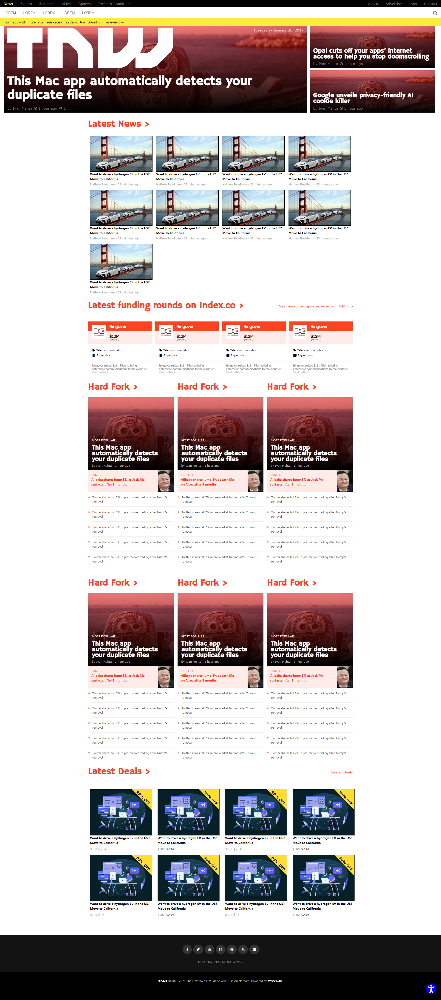

# Responsive-Web-Design

> Project #2 of Microverse where I'll replicate a website making it responsive through different screen sizes

Additional description about the project and its features.

## Built With

- HTM5 & CSS

## Live Demo

[Live Demo Link](https://srizzuto.github.io/Responsive-Web-Design/.)

## Authors

👤 **Sebastian Rizzuto**

- GitHub: [@srizzuto](https://github.com/srizzuto)
- Twitter: [@sbstnrzzt](https://twitter.com/sbstnrzzt)
- LinkedIn: [Sebastian Rizzuto](https://www.linkedin.com/in/srizzuto/)

👤 **Mwila Kaunda**

- GitHub: [@Mwila-Kaunda](https://github.com/mwila-kaunda)
- Twitter: [@MwilaKaunda](https://twitter.com/MwilaKaunda) 
- LinkedIn: [Mwila Kaunda](https://linkedin.com/Mwilakaunda) 
## Contributing

Contributions, issues, and feature requests are welcome!

Feel free to check the [issues page](https://github.com/srizzuto/Responsive-Web-Design/issues).

## Show your support

Give a ⭐️ if you like this project!

## Acknowledgments

- To my coding partner who helped me through all the work
- To my Stand Up Team who kept my morale up!
